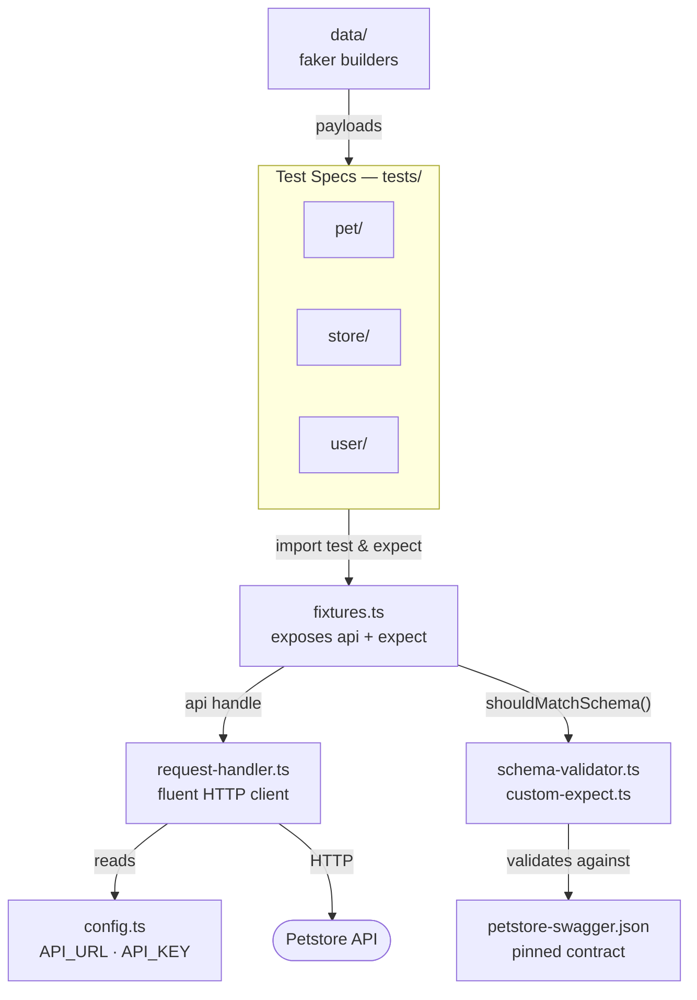

# Petstore API Test Suite

API test suite for the public [Swagger Petstore](https://petstore.swagger.io/v2) demo API, built with **Playwright Test + TypeScript**. Covers 48 endpoint specs across three resource domains — `pet`, `store`, `user` — with schema validation and faker-generated payloads.

## Codebase diagram



## Framework layers

The suite is organized in three layers:

**1. Specs** (`tests/pet/`, `tests/store/`, `tests/user/`)
Each file targets one endpoint + behavior. Specs import from `lib/` only — they never reach into other spec files.

**2. Library** (`lib/`)
Shared framework code that specs consume:

| File | Role |
|---|---|
| `fixtures.ts` | Playwright `test.extend` — exposes the `api` handle and extended `expect` |
| `request-handler.ts` | Fluent HTTP client built on `APIRequestContext` — sets base URL, injects auth header, asserts status, parses body |
| `config.ts` | Reads `API_URL` / `API_KEY` from env; single source of truth, nothing hardcoded in specs |
| `custom-expect.ts` | Adds `expect(body).shouldMatchSchema('Pet')` |
| `schema-validator.ts` | Ajv instance compiled from the pinned `swagger.json` |
| `data/` | faker-based builders — `buildPet()`, `buildOrder()`, `buildUser()` — return unique payloads each run |

**3. External**
The live `https://petstore.swagger.io/v2` API. Tests run serially (`workers: 1`) because the public server has mutable global state.

## Directory layout

```
lib/
  request-handler.ts              Fluent HTTP client + status assertion
  fixtures.ts                     Playwright fixtures (api, expect)
  config.ts                       Base URL + API key from env
  custom-expect.ts                expect.shouldMatchSchema(definitionName)
  schema-validator.ts             Ajv compiled from swagger definitions
  data/                           Payload builders (pet, order, user, image)
tests/
  pet/ store/ user/               Endpoint specs — one behavior per file
  fixtures/petstore-swagger.json  Pinned OpenAPI contract
specs/
  petstore-api.plan.md            Source of truth for what's being tested
playwright.config.ts              Runner config, reporters, baseURL
```

## Prerequisites

- **Node.js** (LTS recommended)
- **npm**

## Setup

```bash
git clone <repo-url>
cd pet-store-test-project
npm install
npx playwright install --with-deps
```

Copy the example env file and adjust if needed:

```bash
cp .env.example .env
```

### Environment variables

| Variable | Default | Description |
|---|---|---|
| `API_URL` | `https://petstore.swagger.io/v2` | Base URL of the target API |
| `API_KEY` | `special-key` | Sent as the `api_key` header on every request |
| `TEST_ENV` | `dev` | Label shown in console output (`dev` \| `staging` \| `prod`) |

## Running tests

```bash
npm test                # run all specs
npm run test:pet        # pet domain only
npm run test:store      # store domain only
npm run test:user       # user domain only
npm run report          # open the HTML report in a browser
npm run schema:sync     # refresh the pinned swagger.json from the live API
```

## Key design decisions

- **`RequestHandler` (fluent builder)** — one place to set base URL, inject the auth header, assert the status code, and parse the body. Specs stay short and declarative (`api.path('/pet').body(p).postRequest(200)`) instead of repeating boilerplate.
- **Worker-scoped `apiContext` + per-test `api` fixture** — reuse one HTTP context per worker for speed; each test gets a clean handler with no leftover state.
- **faker data builders** — generate unique, valid payloads each run to avoid ID collisions on the shared public server.
- **Ajv schema validator + `expect.shouldMatchSchema`** — assert responses against the real `swagger.json` definitions, giving contract coverage without hand-writing field-by-field checks.
- **Pinned `swagger.json` + `schema:sync` script** — lock the contract locally for deterministic validation; refresh on demand.
- **`sendRaw` escape hatch** — for endpoints where the demo API returns ambiguous status codes, tests can branch on the raw `{ status, body }` response.
- **Serial execution** — the public server has mutable global state; running serially prevents cross-test interference.

## Notes

- The Petstore demo server is **public, stateful, and occasionally flaky** — expect intermittent failures unrelated to test correctness.
- `TEST_ENV` is read by `config.ts` but currently only logged — environment switching is scaffolded, not yet wired to per-environment config blocks.

## Next steps

- **CI/CD**: wire up GitHub Actions to run the suite on push/PR.
- **QA Sphere integration**: annotate specs with `tms(caseId)` and upload results via `qas-cli`.
- **Deterministic test target**: stand up a mock from the OpenAPI spec (e.g. Prism) so tests don't depend on the flaky public server, then lift `workers: 1` to parallelize.
- **Wire `TEST_ENV`** to real per-environment config blocks.
- **Type the responses**: add generics to `RequestHandler` so `postRequest<Pet>(200)` returns a typed body.
- **Close coverage gaps**: more auth/negative-path and concurrency cases.
